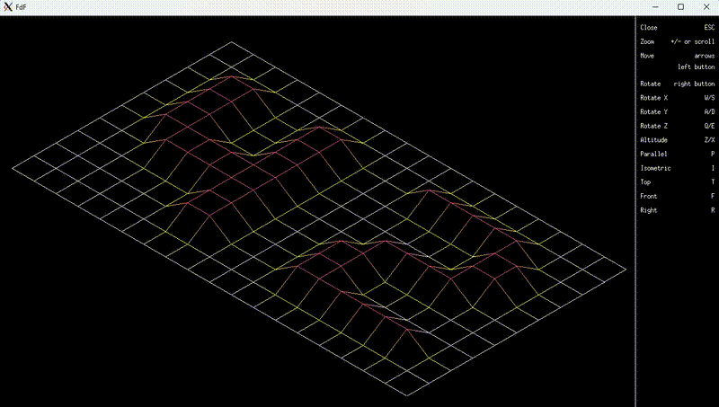

# 42-FdF

The FdF (Fil de Fer) project aims to project a 3D map into a 2D screen using the MiniLibX library.

<p align="center">
  <br />
</p>

## Description

The program takes a file containing a grid of heights and translates it into a visual representation, allowing the user to interact with the map through keyboard and mouse controls.

**Features**
*   **Map reading:** reads a 3D map data from a `.fdf` file
*   **Projections:** implements different types of projections:
    *   Isometric
    *   Parallel
    *   Top
    *   Front
    *   Right
*   **User interaction:**
    *   **Zoom:** zoom in and out using the `+` and `-` keys or the mouse scroll wheel
    *   **Translation:** move the map using the arrow keys or dragging with the right mouse button
    *   **Rotation:** rotate the map around the X, Y, and Z axes using the `W`, `S`, `A`, `D`, `Q`, and `E` keys or dragging with the left mouse button
    *   **Altitude:** change the altitude of the map using the `X` and `Z` keys
    *   **Projection:** switch between different projections using the `I` (isometric), `P` (´parallel), `T` (top), `F` (front) and `R` (right) keys
*   **Color Interpolation:** implements color interpolation when drawing lines between points
*   **Menu:** displays an on-screen menu with keyboard and mouse controls

## Drawing a line

The core challenge of this project involves rendering lines to connect the points of the 3D map. Initially, I explored the Bresenham algorithm, which uses integer arithmetic and a decision variable for efficient line drawing. However, after encountering issues (particularly an infinite loop), I shifted to the DDA algorithm, known for its straightforward approach and ease of implementation.

The **DDA (Digital Differential Analyzer) algorithm** is a line-drawing algorithm that calculates and interpolates intermediate points between two given coordinates (x1, y1) and (x2, y2). It works by incrementally stepping along the line, determining the closest pixel to the ideal line at each step. Here's a breakdown of the process:

1. Calculate the differences in the x and y coordinates:
```c
dx = x2 - x1;
dy = y2 - y1;
```
2. Determine the number of steps required based on the greater difference:
```c
if (abs(dx) > abs(dy)) 
   steps = abs(dx)
else
   steps = abs(dy);
```
3. Calculate the increments for each step:
```c
x_inc = dx / steps;
y_inc = dy / steps;
```
4. Start at the initial point and incrementally plot each pixel:
```c
for (i = 0; i <= steps; i++) {
    draw_pixel(x, y);
    x += x_inc;
    y += y_inc;
}
```

## MiniLibX

The MiniLibX library is a simple, lightweight graphics library developed for educational purposes. It provides a basic set of functions for creating graphical applications, drawing pixels, and handling events from user input.<br />

**Main functions**
*  `mlx_init`: initializes the connection between the program and the graphical system
*  `mlx_new_window`: creates a new window where the graphics will be displayed
*  `mlx_new_image`: allocates memory for a new image that can be drawn and manipulated before displaying it in the window
*  `mlx_get_data_addr`: obtains a pointer to the image's memory area where you can directly manipulate the pixel data, and other information about the image
*  `mlx_pixel_put`: draws a single pixel at the given coordinates with the specified color
*  `mlx_put_image_to_window`: displays an image in the specified window at the given coordinates
*  `mlx_string_put`: puts a string of text on the window at the specified coordinates
*  `mlx_hook`: sets up callback functions to handle events in the window, such as key press and mouse movement
*  `mlx_loop`: enters an infinite loop that detects events and refreshes the window as needed

Useful links: [documentation](https://github.com/42Paris/minilibx-linux)   |   [manual](https://harm-smits.github.io/42docs/libs/minilibx)
